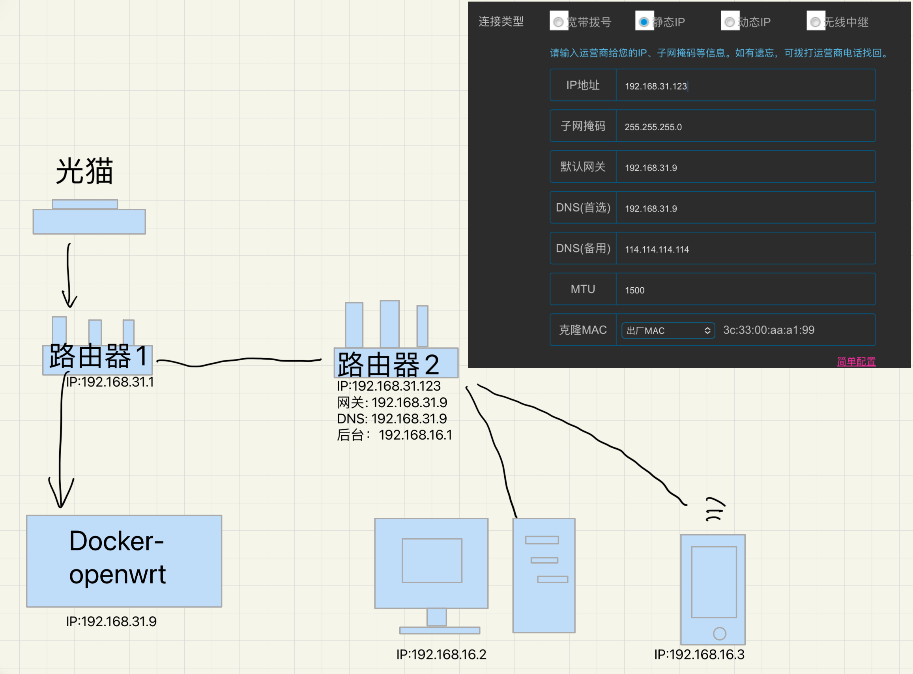

## 安装docker-openwrt
下载[最新版openwrt](https://hub.docker.com/r/piaoyizy/openwrt-x86), 由于指定 latest标签未必是最新版，因此手动指定Digest版本下载
```
docker pull piaoyizy/openwrt-x86@sha256:ccfe467e8735c8cb121a790fb6b64476f7b83decd45bceefebb125b6924a8dcf
```


## 旁路由模式

### 宿主机的网络设置
查看你的网络配置`ip a`
```
$ ip a

2: eno1: <BROADCAST,MULTICAST,UP,LOWER_UP> mtu 1500 qdisc mq state UP group default qlen 1000
    link/ether xxxxxx
    altname enp1s0
    inet 192.168.31.6/24 metric 100 brd 192.168.31.255 scope global dynamic eno1
       valid_lft 31022sec preferred_lft 31022sec

```
可以看到你的物理网卡为`eno1`, ipv4地址是`192.168.31.6`, 网关就是你路由器地址`192.168.31.1`

开启混杂模式
```
ip link set eno1 promisc on
```

 
创建macvlan
```
docker network create -d macvlan --subnet=192.168.31.0/24 --gateway=192.168.31.1 -o parent=eno1 macnet
```

### 创建openwrt容器并启动
```
docker run -d --name=openwrt --restart always --privileged --network macnet --ip 192.168.31.9 4decb85ef086
```
- 这里的`4decb85ef086`是你的openwrt镜像id（因为通过digest下载的镜像，其tag为none，只能通过id指定镜像）
- `--ip` 是为openwrt分配新的ip，要求路由器1上没有冲突的ip

### 容器的网络设置
**注意：一定不要在容器初次创建时候，马上修改配置文件！！否则可能会造成软路由无法访问的问题！！**
修改openwrt监听地址，先进入容器
```
docker exec -it openwrt bash
```
找到lan->ipaddr, 把  `option ipaddr` 改为创建容器时候传入的ip，其他不用动
```
config interface 'lan'
        option type 'bridge'
        option ifname 'eth0'
        option proto 'static'
        option ipaddr '192.168.31.9'
        option netmask '255.255.255.0'
        option ip6assign '60'
```

接着重启网络配置
```
/etc/init.d/network restart
```

> 如果此时报错 request timeout, 执行`docker rm -f openwrt`删掉容器，换个地址重新启动容器。 


### openwrt的设置

进去你路由器1后台看看是否有新设备加入。

打开浏览器，输入该ip地址，进入openwrt管理界面，默认账号密码：
- 账号:`root`
- 密码:`password`

#### 解决无法上网问题
此时路由器没有配置DNS是无法上网的，我们需要手动配置一下。
1. 接口->LAN->物理设置，取消桥接
2. 基本设置，填写网关和DNS(重要)
	> DNS和网关就是你路由器1地址


3. 设置防火墙规则，否则无法连接国内网站
	1. 网络->防火墙->自定义规则，添加一行
```
iptables -t nat -I POSTROUTING -o eth0 -j MASQUERADE
```
解放无法上网的问题参考：
1. https://github.com/coolsnowwolf/lede/issues/5520#issuecomment-1258094178
2. https://www.right.com.cn/forum/thread-4453763-1-1.html

点击应用&保存。接着去 `网络`->`网络诊断` 测试能否PING通


### 配置科学上网：
`服务`->`PassWall`->`节点订阅` -> `添加`->`保存&应用`


### 路由器2设置

连接路由器1，随便使用一个不冲突的静态IP，将网关和DNS指向openwrt的后台地址即可


### 其他设备连接路由
- 直接连接路由器2
- 连接路由器1，把网关和DNS设置为软路由的IP地址。（和路由器2一样设置）


参考：
- 安装参考： https://www.bilibili.com/video/BV1d3411J7bp/?spm_id_from=333.337.search-card.all.click&vd_source=cdd8cee3d9edbcdd99486a833d261c72
- 配置参考
	- https://www.bilibili.com/video/BV1P54y167sj/?spm_id_from=333.337.search-card.all.click&vd_source=cdd8cee3d9edbcdd99486a833d261c72
	- https://www.cfmem.com/2021/08/docker-openwrt.html


---
## 主路由模式


安装openwrt的方法和旁路路由一样，不再赘述。由于我的主机只有一个网卡，因此需要外接一个usb网卡。

### 将usb网卡接入docker
usb网卡插入宿主机后，宿主机通过`ip addr`查看网卡信息
```
49: enx98fc84e631d8: <BROADCAST,MULTICAST> mtu 1500 qdisc noop state DOWN group default qlen 1000
    link/ether xx:xx:xx:xx:xx:xx brd ff:ff:ff:ff:ff:ff
```
### 开启网卡混杂模式
```
ip link set enx98fc84e631d8 promisc on
```

### 配置macvlan-LAN (分配子网)
```
docker network create -d macvlan --subnet=192.168.10.0/24 --gateway=192.168.10.1 -o parent=enx98fc84e631d8 maclan
```
- 注意：这里的ip是出口流量，不要和入口网段的重复，否则会报错 `Error response from daemon: Pool overlaps with other one on this address space`
### 配置macvlan-WAN（连接上级路由器）

```
docker network create -d macvlan --subnet=192.168.31.0/24 --gateway=192.168.31.1 -o parent=eno1 macwan
```
如果报错`Error response from daemon: Pool overlaps with other one on this address space`， 则表明你已经创建过该网段的ip了，例如设置旁路由模式时创建的macnet，我们手动删掉后再重新能创建名称为macwan的虚拟网卡。
```
docker network remove macnet
```


查看我们创建的macvlan
```
root@tignioj:/home/tignioj# docker network ls
NETWORK ID     NAME                            DRIVER    SCOPE
0f8454c993d1   bridge                          bridge    local
affe8455be33   host                            host      local
db808af93889   maclan                          macvlan   local
8d17e95ddffd   macwan                          macvlan   local
4ce31b09b3d3   none                            null      local
```

- `maclan`绑定了usb网卡，用于连接子路由器，通过该网口可以进入软路由页面
- `macwan`绑定自带的以太网网口，用于连接上级路由，通过该路由可以给软路由联网（或者桥接让软路由拨号）
### 创建openwrt容器并启动
指定一个网口(maclan)创建容器，另一个后面再手动连接。
```
docker run -d --name=openwrt --restart always --privileged --network maclan --ip 192.168.10.9 4decb85ef086
```
- 这里的ip允许范围为192.168.10.0/24，即`192.168.10.2~192.168.10.254`
- 容器创建时，指定lan网络，不同于旁路由模式，指定的是wan网络。

> 网络知识补充-子网，来源ChatGPT4
```
IP地址192.168.10.0/24表示的是一个子网，在其中192.168.10.0是网络地址，末尾的"/24"表示的是子网掩码的位数。这意味着，子网掩码的前24位是网络部分，后8位是主机部分。

在这种情况下，/24子网掩码等同于255.255.255.0，即前24位为1，后8位为0。

因此，这个子网的IP地址范围为192.168.10.0到192.168.10.255。其中：

- 192.168.10.0是网络地址。
- 192.168.10.1到192.168.10.254可以被分配给主机使用。
- 192.168.10.255是广播地址。

也就是说，这个子网可以分配给254台主机使用
```

###  进入容器手动指定ip地址并重启网络
```
docker exec -it openwrt bash
```
指定ip地址
```
vim /etc/config/network
```
修改`option ipaddr '192.168.10.9'`

```
config interface 'loopback'
        option ifname 'lo'
        option proto 'static'
        option ipaddr '127.0.0.1'
        option netmask '255.0.0.0'

config globals 'globals'
        option ula_prefix 'fd1e:a12b:82fa::/48'

config interface 'lan'
        option type 'bridge'
        option ifname 'eth0'
        option proto 'static'
        option ipaddr '192.168.10.9'
        option netmask '255.255.255.0'
        option ip6assign '60'

config interface 'utun'
        option proto 'none'
        option ifname 'utun'
        option device 'utun'

```

重启网络
```
/etc/init.d/network restart
```

此时再查看ip，可以看到`br-lan` 已经分配了ip地址
```
bash-5.2# ip a
1: lo: <LOOPBACK,UP,LOWER_UP> mtu 65536 qdisc noqueue state UNKNOWN group default qlen 1000
    link/loopback 00:00:00:00:00:00 brd 00:00:00:00:00:00
    inet 127.0.0.1/8 scope host lo
       valid_lft forever preferred_lft forever
    inet6 ::1/128 scope host 
       valid_lft forever preferred_lft forever
3: br-lan: <BROADCAST,MULTICAST,UP,LOWER_UP> mtu 1500 qdisc noqueue state UP group default qlen 1000
    link/ether 02:42:c0:a8:0a:09 brd ff:ff:ff:ff:ff:ff
    inet 192.168.10.9/24 brd 192.168.10.255 scope global br-lan
       valid_lft forever preferred_lft forever
70: eth0@if52: <BROADCAST,MULTICAST,UP,LOWER_UP> mtu 1500 qdisc noqueue master br-lan state UP group default 
    link/ether 02:42:c0:a8:0a:09 brd ff:ff:ff:ff:ff:ff link-netnsid 0
```

验证后台地址是否能访问`curl -I 192.168.10.9`
出现302表示有响应，这时候你可以通过电脑连接LAN口（也就是USB网卡）进入软路由
```
bash-5.2# curl -I 192.168.10.9
HTTP/1.1 302 Found
Connection: Keep-Alive
Keep-Alive: timeout=20
Location: /cgi-bin/luci/

```
### 软路由连接WAN口-使软路由连接网络
输入`exit`退出容器后，使用`docker network connect [网络] [容器名称|容器id]`  使网卡挂载到openwrt容器。
```
docker network connect macwan openwrt
```

再次进入容器, 输入 `ip a` 查看网卡
```
bash-5.2# ip a
1: lo: <LOOPBACK,UP,LOWER_UP> mtu 65536 qdisc noqueue state UNKNOWN group default qlen 1000
    link/loopback 00:00:00:00:00:00 brd 00:00:00:00:00:00
    inet 127.0.0.1/8 scope host lo
       valid_lft forever preferred_lft forever
    inet6 ::1/128 scope host 
       valid_lft forever preferred_lft forever
3: br-lan: <BROADCAST,MULTICAST,UP,LOWER_UP> mtu 1500 qdisc noqueue state UP group default qlen 1000
    link/ether 02:42:c0:a8:0a:09 brd ff:ff:ff:ff:ff:ff
    inet 192.168.10.9/24 brd 192.168.10.255 scope global br-lan
       valid_lft forever preferred_lft forever
80: eth0@if52: <BROADCAST,MULTICAST,UP,LOWER_UP> mtu 1500 qdisc noqueue master br-lan state UP group default 
    link/ether 02:42:c0:a8:0a:09 brd ff:ff:ff:ff:ff:ff link-netnsid 0
81: eth1@if2: <BROADCAST,MULTICAST,UP,LOWER_UP> mtu 1500 qdisc noqueue state UP group default 
    link/ether 02:42:c0:a8:1f:02 brd ff:ff:ff:ff:ff:ff link-netnsid 0
    inet 192.168.31.2/24 brd 192.168.31.255 scope global eth1
       valid_lft forever preferred_lft forever

```
可以看到eth1 主动从路由器上获取了`192.168.31.2`的地址，但是实际上我去上级路由器并没有看到openwrt设备，于是配置network，编辑 `vim /etc/config/network`, 添加以下设置让openwrt自动获取ip地址
```
config interface 'wan'
        option ifname 'eth1'
        option proto 'dhcp
```
保存后，重启网络
```
/etc/init.d/network restart
```

再次查看ip
```
bash-5.2# ip a
1: lo: <LOOPBACK,UP,LOWER_UP> mtu 65536 qdisc noqueue state UNKNOWN group default qlen 1000
    link/loopback 00:00:00:00:00:00 brd 00:00:00:00:00:00
    inet 127.0.0.1/8 scope host lo
       valid_lft forever preferred_lft forever
    inet6 ::1/128 scope host 
       valid_lft forever preferred_lft forever
4: br-lan: <BROADCAST,MULTICAST,UP,LOWER_UP> mtu 1500 qdisc noqueue state UP group default qlen 1000
    link/ether 02:42:c0:a8:0a:09 brd ff:ff:ff:ff:ff:ff
    inet 192.168.10.9/24 brd 192.168.10.255 scope global br-lan
       valid_lft forever preferred_lft forever
80: eth0@if52: <BROADCAST,MULTICAST,UP,LOWER_UP> mtu 1500 qdisc noqueue master br-lan state UP group default 
    link/ether 02:42:c0:a8:0a:09 brd ff:ff:ff:ff:ff:ff link-netnsid 0
81: eth1@if2: <BROADCAST,MULTICAST,UP,LOWER_UP> mtu 1500 qdisc noqueue state UP group default 
    link/ether 02:42:c0:a8:1f:02 brd ff:ff:ff:ff:ff:ff link-netnsid 0
    inet 192.168.31.18/24 brd 192.168.31.255 scope global eth1
       valid_lft forever preferred_lft forever
    inet6 fe80::42:c0ff:fea8:1f02/64 scope link 
       valid_lft forever preferred_lft forever
```
可以看到分配了`192.168.31.18` 的地址，我们去上级路由器后台也能看到该ip，这时候可以上网了。

### 参考
- https://www.treesir.pub/post/openwrt-docker-multi-net/
- https://www.cnblogs.com/luoshuifushen/p/16989469.html


